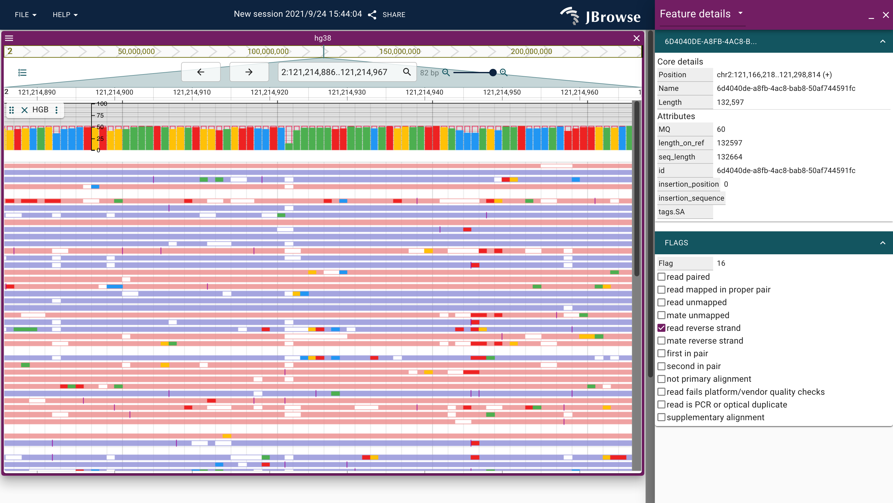
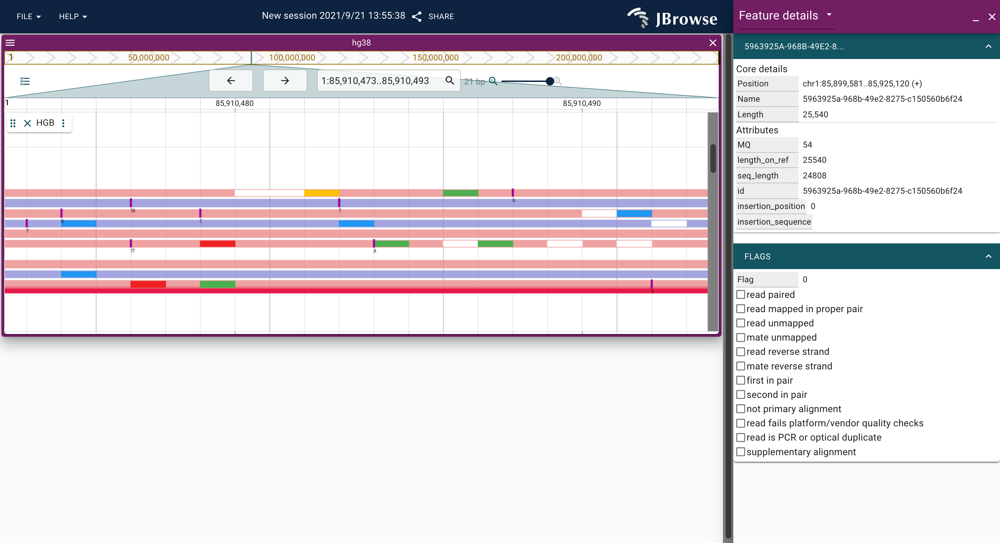

# jbrowse-plugin-hgb　

[](https://github.com/6br/jbrowse-plugin-hgb/actions/workflows/ci.yml)

JBrowse2 plugin for displaying long-read alignments by hgb.

## Screenshot




## Prerequisites

* Rust (cargo)
* Node.js

## Getting Started

The input bam file needs to be attached MD tags by `samtools calmd` and indexed by `samtools index`.

* Docker

```bash
docker run --rm -ti -p 9000:9000 -v `pwd`:/data 6thbridge/jbrowse2-hgb:master /data/<input.bam>
```

* Singularity

```bash
singularity build jb2-hgb.sif docker://6thbridge/jbrowse2-hgb:master
singularity -s run jb2-hgb.sif <input.bam>
```

Access to `http://localhost:9000/static/index.html`.

## Manual Deploy

### STEP1: Serve HGB server

```bash
bash -x start_hgb_server.sh $NUM_OF_THREADS $LOCATION_OF_BAM
bash -x start_hgb_server.sh $NUM_OF_THREADS $LOCATION_OF_BAM 0.0.0.0:5000
```

### STEP2: Start JBrowse2

The following command needs to run on another shell.

```bash
bash -x start_jbrowse_hgb.sh 
bash -x start_jbrowse_hgb.sh $HGB_SERVER_URL 38
bash -x start_jbrowse_hgb.sh $HGB_SERVER_URL 19
```

You can specify reference genome as the second argument as 38 or 19 (hg38 or hg19, respectively).

## Usage in jbrowse-web

Add to the "plugins" of your JBrowse Web config. The unpkg CDN should be stable, or you can download the js file to your server

```json
{
  "plugins": [
    {
      "name": "hgb",
      "url": "https://unpkg.com/jbrowse-plugin-hgb/dist/jbrowse-plugin-hgb.umd.production.min.js"
    }
  ]
}
```

This plugin is currently quite basic, and there is no mouseover interactivity or drawn labels on features

### For use in jbrowse/react-linear-genome-view

See [DEVELOPMENT](DEVELOPMENT.md)
